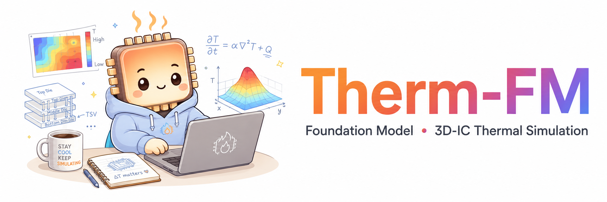
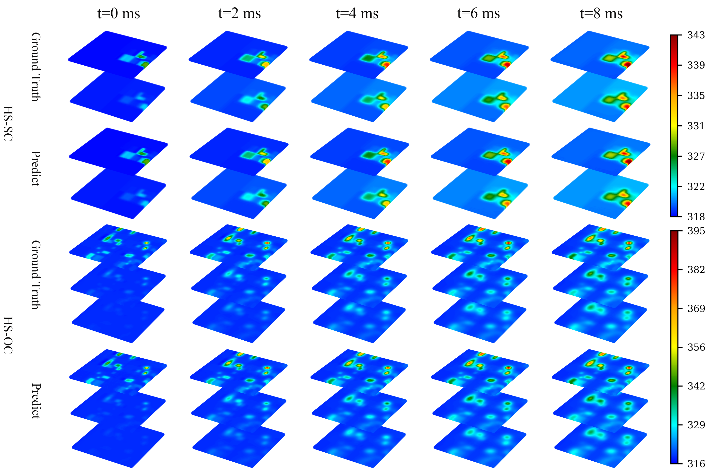

<p align="center">
  
</p>
        
<h1 align="center">
  Therm-FM: Foundation Model is ALL YOU NEED for 3D-ICs Thermal Simulation
</h1>
  
<p align="center">
  <b>PDE Foundation Model Adaptation for Steady-State and Transient 3D-IC Thermal Simulation</b>
</p>

<p align="center">
  <a href="https://arxiv.org/abs/2605.22663">
    
  </a>
  
  
  
  
</p>

<p align="center">
  <a href="https://arxiv.org/abs/2605.22663"><b>Paper</b></a> ·
  <a href="#code-datasets-model-checkpoints"><b>Datasets</b></a> ·
  <a href="#code-datasets-model-checkpoints"><b>Checkpoints</b></a> ·
  <a href="#highlights"><b>Highlights</b></a>
</p>

---  

This repository contains the official implementation for  
[**Therm-FM: Foundation Model is ALL YOU NEED for 3D-ICs Thermal Simulation**](https://arxiv.org/abs/2605.22663).

**Therm-FM** adapts a pretrained PDE foundation model to steady-state and transient 3D-IC thermal simulation. It is built on top of [Poseidon](https://arxiv.org/abs/2405.19101) and the `scOT` codebase, with thermal dataset loaders, benchmark configurations, normalization handling, and evaluation scripts for 3D-IC thermal prediction.

<p align="center">
  
</p>

---

## News

> 💐 **[DAC 2026]** The preliminary conference version, **“From Fluid Dynamics to Chip Design: PDE Foundation Models Address the Data Bottleneck in 3D-IC Thermal Simulation,”** has been accepted by the **63rd ACM/IEEE Design Automation Conference (DAC 2026, CCF-A)** 🎉🎉.

> 🚀 **[May 2026]** We released the arXiv preprint, code, datasets, normalization constants, and model checkpoints for **Therm-FM**.

> ☕️ **[May 2026]** **Therm-FM** is an extended journal version currently under review at **IEEE TCAD**.

Compared with the DAC version, **Therm-FM** extends the study from steady-state thermal prediction to both steady-state and transient simulation. It further expands the benchmark with industrial-scale 3D-IC datasets and releases the datasets and checkpoints. We also introduce a thermal-equivalent model to accelerate data generation, together with a multi-fidelity training strategy to reduce high-fidelity simulation cost. In addition, Therm-FM is, to our knowledge, the first work in ML-based thermal simulation to systematically evaluate cross-chip generalization, which we believe is a key capability for practical thermal modeling.

---

## Highlights

<table>
  <tr>
    <td>🔥 <b>Foundation-model adaptation</b></td>
    <td>PDE foundation-model adaptation for 3D-IC thermal simulation.</td>
  </tr>
  <tr>
    <td>⏱️ <b>Steady + transient</b></td>
    <td>Unified support for steady-state and transient thermal prediction.</td>
  </tr>
  <tr>
    <td>🏭 <b>Industrial benchmarks</b></td>
    <td>HotSpot and industrial 3D-IC benchmark support.</td>
  </tr>
  <tr>
    <td>⚡ <b>Multi-fidelity training</b></td>
    <td>Thermal-equivalent multi-fidelity training for reduced high-fidelity data cost.</td>
  </tr>
  <tr>
    <td>📦 <b>Open resources</b></td>
    <td>Released datasets, normalization constants, and model checkpoints.</td>
  </tr>
  <tr>
    <td>📊 <b>Thermal metrics</b></td>
    <td>Evaluation scripts with denormalized RMSE, Max, Mean, MAPE, and PAPE metrics.</td>
  </tr>
</table>

---

## Code, Datasets, Model Checkpoints

| Resource | Status | Link |
|---|---:|---|
| Code | ✅ Released | This repository |
| Datasets | ✅ Released | [Google Drive](https://drive.google.com/drive/u/1/folders/1WzjpOAgeua03F3iLodHlVbTsRhXn1lMA) |
| Model Checkpoints | ✅ Released | [Google Drive](https://drive.google.com/drive/folders/1yMkLwpMDaNrVXxJlzaOLt9n6G_1MFN_I?usp=sharing) |
## Installation

Clone this repository and install it in editable mode:

```bash
pip install -e .
```

We recommend using a virtual environment or conda environment. The main dependencies are listed in `pyproject.toml`, including PyTorch, Transformers, Accelerate, h5py, SciPy, and Weights & Biases.

If you use `accelerate launch` for training, configure Accelerate first:

```bash
accelerate config
```

## Repository Structure

The committed source tree is organized as:

```text
Therm-FM/
├── assets/              # paper figures
├── configs/             # Training/evaluation YAML configs
├── scOT/                # Model, trainer, datasets, and evaluation scripts
├── LICENSE
├── pyproject.toml
└── README.md
```

The following large directories are not committed to git and should be downloaded separately:

```text
Therm-FM/
├── data/                # Extracted datasets
├── checkpoints/         # Extracted model checkpoints
```

Detailed dataset and checkpoint archive information is provided in the README files included with the dataset and model releases.

## Datasets

Dataset download: [Google Drive](https://drive.google.com/drive/folders/1WzjpOAgeua03F3iLodHlVbTsRhXn1lMA?usp=sharing)

After downloading and extracting the dataset archives, the expected layout is:

```text
data/
├── thermal_steady/
│   ├── HS_SC_refine1/
│   ├── HS_SC_refine2/
│   ├── HS_QC_refine1/
│   ├── HS_QC_refine2/
│   ├── HS_OC_refine1/
│   ├── HS_OC_refine2/
│   ├── IND_8C/
│   └── IND_32C/
├── thermal_transient/
│   ├── HS_SC_refine2/
│   ├── HS_QC_refine2/
│   └── HS_OC_refine2/
├── normalization_constants/
└── README.md
```

Each benchmark case contains `input.mat` and `output.mat`. The dataset key inside each `.mat` file is `data`.

The dataset release also includes precomputed normalization constants. During training and evaluation, pass them with `--stats_json` when you want to reproduce the released normalization exactly. If `--stats_json` is not provided, the code recomputes normalization constants from the current training dataset.

## Model Checkpoints

Model checkpoint download: [Google Drive](https://drive.google.com/drive/folders/1yMkLwpMDaNrVXxJlzaOLt9n6G_1MFN_I?usp=sharing)

After downloading and extracting the model archives, the expected layout is:

```text
checkpoints/
├── thermal_steady/
│   ├── HS_SC_refine1/
│   ├── HS_SC_refine2/
│   ├── HS_QC_refine1/
│   ├── HS_QC_refine2/
│   ├── HS_OC_refine1/
│   ├── HS_OC_refine2/
│   ├── IND_8C/
│   └── IND_32C/
├── thermal_transient/
│    ├── HS_SC_refine2/
│    ├── HS_QC_refine2/
│    └── HS_OC_refine2/
└── README.md
```

Each benchmark directory contains `model_T`, `model_B`, and `model_L` subdirectories. Each model directory contains the minimal files required for evaluation and inference:

```text
config.json
pytorch_model.bin
normalization_constants.json
```

The model scales are:

| Model | Size |
|---|---:|
| `model_T` | 21M parameters |
| `model_B` | 158M parameters |
| `model_L` | 629M parameters |

## Evaluation

Use `scOT/evaluate.py` for steady-state thermal benchmarks:

```bash
python scOT/evaluate.py \
  --model_path checkpoints/thermal_steady/HS_SC_refine2/model_T \
  --config configs/run_thermal_steady_T.yaml \
  --data_path data/thermal_steady/HS_SC_refine2 \
  --output_dir eval_outputs/thermal_steady/HS_SC_refine2/model_T \
  --only_test
```

Use `scOT/evaluate_transient.py` for transient thermal benchmarks:

```bash
python scOT/evaluate_transient.py \
  --model_path checkpoints/thermal_transient/HS_SC_refine2/model_T \
  --config configs/run_thermal_transient_T.yaml \
  --data_path data/thermal_transient/HS_SC_refine2 \
  --output_dir eval_outputs/thermal_transient/HS_SC_refine2/model_T \
  --only_test
```

The evaluation scripts automatically load `<model_path>/normalization_constants.json` for thermal datasets. You can override this with:

```bash
--stats_json path/to/normalization_constants.json
```

Match `model_T`, `model_B`, or `model_L` with the corresponding config file: `run_thermal_*_T.yaml`, `run_thermal_*_B.yaml`, or `run_thermal_*_L.yaml`.

## Training and Fine-tuning

Therm-FM uses the same training entry point as Poseidon/scOT, with thermal-specific dataset loaders and configs.

To train Therm-FM from the pretrained PDE foundation model, download the original Poseidon pretrained models separately from the [Poseidon Hugging Face collection](https://huggingface.co/collections/camlab-ethz/poseidon). They are not included in this repository or in the Therm-FM checkpoint release. After downloading, place them under `checkpoints/pretrained/`:

```text
checkpoints/
└── pretrained/
    ├── poseidon-T/
    ├── poseidon-B/
    └── poseidon-L/
```

Use the matching Poseidon scale for each Therm-FM config: `poseidon-T` with `run_thermal_*_T.yaml`, `poseidon-B` with `run_thermal_*_B.yaml`, and `poseidon-L` with `run_thermal_*_L.yaml`.

Example steady-state training command:

```bash
accelerate launch scOT/train.py \
  --config configs/run_thermal_steady_T.yaml \
  --data_path data/thermal_steady/HS_SC_refine2 \
  --checkpoint_path checkpoints \
  --finetune_from checkpoints/pretrained/poseidon-T \
  --replace_embedding_recovery \
  --wandb_project_name Therm-FM \
  --wandb_run_name HS_SC_refine2_T
```

Example with a released normalization file:

```bash
accelerate launch scOT/train.py \
  --config configs/run_thermal_transient_T.yaml \
  --data_path data/thermal_transient/HS_OC_refine2 \
  --checkpoint_path checkpoints \
  --finetune_from checkpoints/pretrained/poseidon-T \
  --replace_embedding_recovery \
  --wandb_project_name Therm-FM \
  --wandb_run_name HS_OC_refine2_T \
  --stats_json data/normalization_constants/thermal_transient/HS_OC_normalization_constants.json
```

For all available options:

```bash
accelerate launch scOT/train.py --help
```

## Configurations

The repository provides model-scale-specific configs:

```text
configs/run_thermal_steady_T.yaml
configs/run_thermal_steady_B.yaml
configs/run_thermal_steady_L.yaml
configs/run_thermal_transient_T.yaml
configs/run_thermal_transient_B.yaml
configs/run_thermal_transient_L.yaml
```

The default thermal split is controlled by `train_ratio=0.8`, where 80% of samples are used for train plus validation and 20% are used for testing. The validation set is 10% of the train plus validation portion.

## Results

Therm-FM consistently improves steady-state and transient thermal prediction accuracy across HotSpot and industrial 3D-IC benchmarks. Please refer to the paper for the complete quantitative comparison against FNO, U-FNO, DeepOHeat, ARO, SAU-FNO, and T-Fusion.




## Relationship to Poseidon

Therm-FM is built upon Poseidon and the `scOT` framework. We adapt the pretrained PDE foundation-model backbone to 3D-IC thermal simulation by adding thermal steady/transient dataset loaders, benchmark configs, normalization utilities, and denormalized thermal evaluation metrics.

If you use Therm-FM, please also consider citing Poseidon.

## Citation

If you use this code, datasets, or model checkpoints, please cite:

```bibtex
@misc{huang2026thermfm,
  title={Therm-FM: Foundation Model is ALL YOU NEED for 3D-ICs Thermal Simulation},
  author={Zhen Huang and Haiyang Xin and Wenkai Yang and Yangbo Wei and Zhiping Yu and Yu Zhang and Wei W. Xing and Ting-Jung Lin and Lei He},
  year={2026},
  eprint={2605.22663},
  archivePrefix={arXiv},
  primaryClass={cs.LG}
}
```

Please also cite Poseidon:

```bibtex
@misc{herde2024poseidon,
  title={Poseidon: Efficient Foundation Models for PDEs},
  author={Maximilian Herde and Bogdan Raonić and Tobias Rohner and Roger Käppeli and Roberto Molinaro and Emmanuel de Bézenac and Siddhartha Mishra},
  year={2024},
  eprint={2405.19101},
  archivePrefix={arXiv},
  primaryClass={cs.LG}
}
```

## Acknowledgements

This repository is based on Poseidon/scOT. We thank the Poseidon authors for releasing their code and pretrained PDE foundation models. We also acknowledge the open-source HotSpot simulator and prior learning-based thermal simulation baselines used for comparison in the paper.

## License

This project is released under the MIT License. See [LICENSE](LICENSE) for details.
